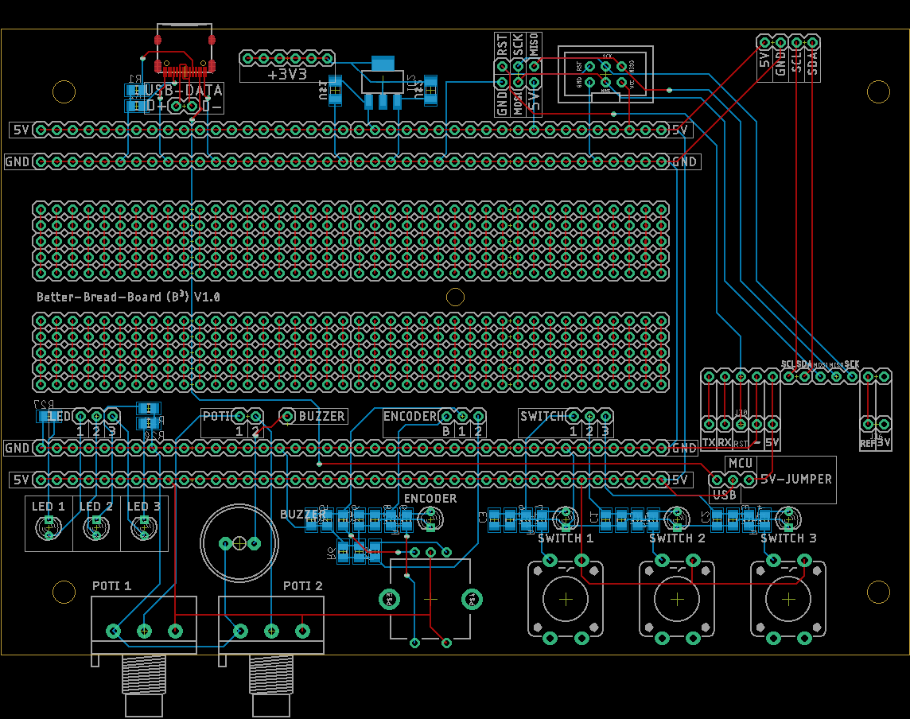
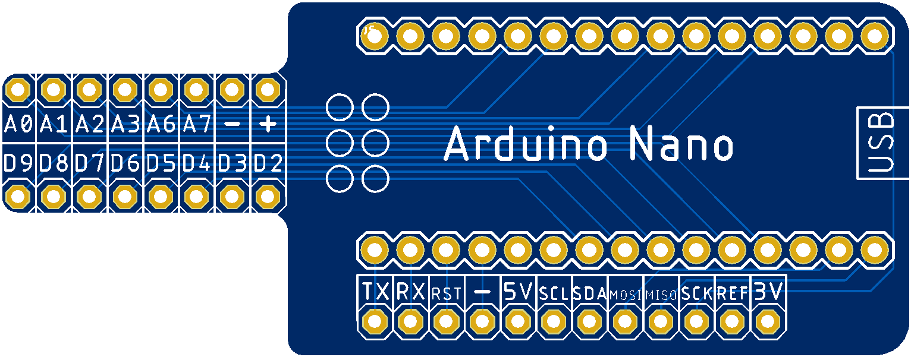
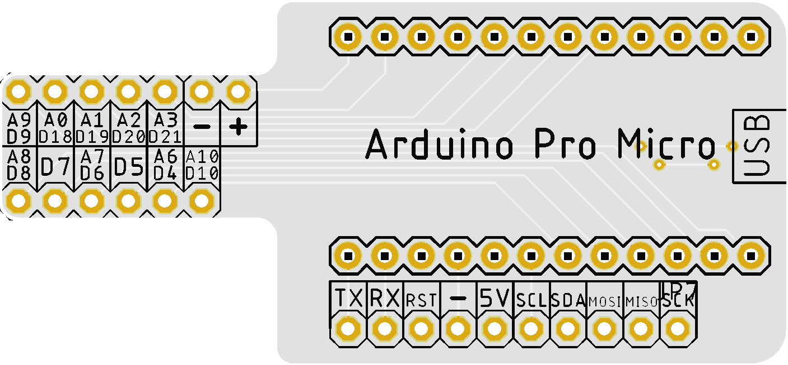
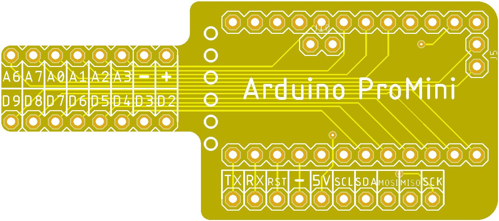

# Vorlage
## Inhaltsverzeichnis
1. [x] [Inhaltsverzeichnis](#Inhaltsverzeichnis)
1. [x] [Beschreibung](#Beschreibung)
1. [x] [Hardware](#Hardware)
   1. [x] [Technische Daten](#technische-daten)
   1. [x] [Datasheet](#datasheet)
   1. [x] [PCB](#PCB)
1. [x] [Software](#Software)
1. [x] [3D](#3D)
1. [x] [Where to buy](#Where-to-buy)
1. [ ] [Abbildungen](#Abbildungen)
1. [x] [Credits](#Credits)

## Beschreibung
Breadboards from china are often very very low quality. So this is a breadboard on my own pcb. I have designed some adapters for different arduino-versions, so I can easily contact them on the breadboard. The board separates serial, spi and I²C-Interfaces. At the top-right I can plug in an OLED-Display easyily.
3.3V comes from an AMS1117. So if something went wrong or I've new ideas it might be, that I make a better version.

## Hardware
### Technische Daten
* 400 pins (200 pins each side) to work with
* 40 GND- and 40 Power-pins at the top and at the bottom
* some LED, Poti, Switches, one encoder and one  buzzer
* Jumper to switch between 5V from USB-C-Connector or from the Microcontroller

### Datasheet
./.

### PCB
* [Adapters](PCB/Adapters)
* [B³ - BetterBreadBoard](PCB)

## Software
./.

## 3D
./.

## Where to buy
./.

## Abbildungen
* 
* 
* 
* 

## Credits
* :+1: [arduino](https://github.com/arduino)
* :+1: [adafruit](https://github.com/adafruit)
* :+1: [sparkfun](https://github.com/sparkfun)
* :+1: [Watterott](https://github.com/watterott) and @awatterott for great SW, HW and products
* :+1: [atom](https://github.com/atom)
* :+1: [mattahan](https://www.deviantart.com/mattahan) for the [Buuf graphics](https://www.deviantart.com/mattahan/art/Buuf-37966044)
* :+1: @ikatyang for the [emoji-cheat-sheet](https://github.com/ikatyang/emoji-cheat-sheet/blob/master/README.md)
